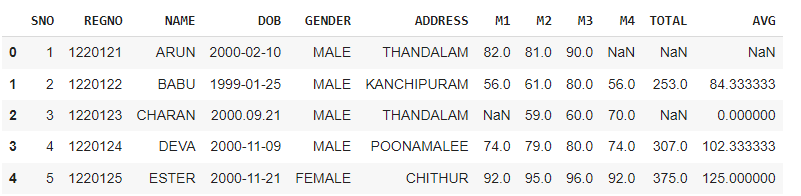
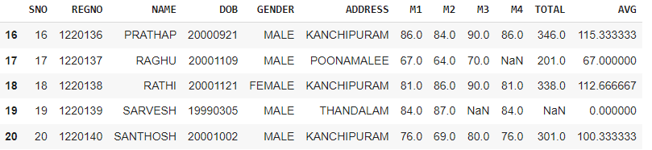

# Exno:1
Data Cleaning Process

# AIM
To read the given data and perform data cleaning and save the cleaned data to a file.

# Explanation
Data cleaning is the process of preparing data for analysis by removing or modifying data that is incorrect ,incompleted , irrelevant , duplicated or improperly formatted. Data cleaning is not simply about erasing data ,but rather finding a way to maximize datasets accuracy without necessarily deleting the information.

# Algorithm
STEP 1: Read the given Data

STEP 2: Get the information about the data

STEP 3: Remove the null values from the data

STEP 4: Save the Clean data to the file

STEP 5: Remove outliers using IQR

STEP 6: Use zscore of to remove outliers

# Coding and Output
```py
import pandas as pd
df=pd.read_csv('/content/SAMPLEIDS.csv')
df
```

```py
df.head()
```

```py
df.tail()
```

```py
df.describe()
```

```py
df.info()
```

```py
df.shape
```

```py
df.isnull().sum()
```

```py
df.nunique()
```

```py
df['GENDER'].value_counts()
```

```py
mm=df.TOTAL.mean()
mm
```

```py
df.TOTAL.fillna(mm,inplace=True)
df
```

```py
x=df.M4.min()
x
```

```py
df.M4.fillna(x,inplace=True)
df
```

```py
df.duplicated()
```

```py
df.drop_duplicates(inplace=True)
```

```py
df['DOB']
```

```py
y=pd.to_datetime(df['DOB'])
y
```

```py
df['DOB']=pd.to_datetime(df['DOB'])
df
```

```py
import seaborn as sns
sns.heatmap(df.isnull(),yticklabels=False,annot=True)
```

```py
df.dropna(inplace=True)
sns.heatmap(df.isnull(),yticklabels=False,annot=True)
```

```py
df.shape
```

## OUTLIER DETECTION AND REMOVAL
```py
import pandas as pd
import seaborn as sns
import numpy as np
age=[1,3,28,27,25,92,30,39,40,50,26,24,29,94]
af=pd.DataFrame(age)
af
```

```py
sns.boxplot(data=af)
```

```py
sns.scatterplot(data=af)
```

```py
Q1=np.percentile(af,25)
Q3=np.percentile(af,75)
IQR=Q3-Q1
IQR
```

```py
lower_bound=Q1-1.5*IQR
upper_bound=Q3+1.5*IQR
outliers=[x for x in age if x< lower_bound or x>upper_bound]
print("Q1:",Q1)
print("Q3:",Q3)
print("IQR:",IQR)
print("Lower Bound:",lower_bound)
print("Upper Bound:"),upper_bound
print("outliers:",outliers)
```

```py
af=af[((af>=lower_bound)&(af<=upper_bound))]
af
```

```py
af.dropna()
```

```py
sns.boxplot(data=af)
```

```py
sns.scatterplot(data=af)
```

```py
import pandas as pd
import numpy as np
import seaborn as sns
from scipy import stats
data={'Weight':[12,15,18,21,24,27,30,33,36,39,42,45,48,51,54,57,60,63,66,69,202,72,75,78,81,84,232,87,90,93,96,99,258]}
df=pd.DataFrame(data)
df
```

```py
z=np.abs(stats.zscore(df))
```

```py
print(df[z['Weight']>3])
```

# Result
Hence the Data Cleaning process is performed successfully on the given data using python code.
